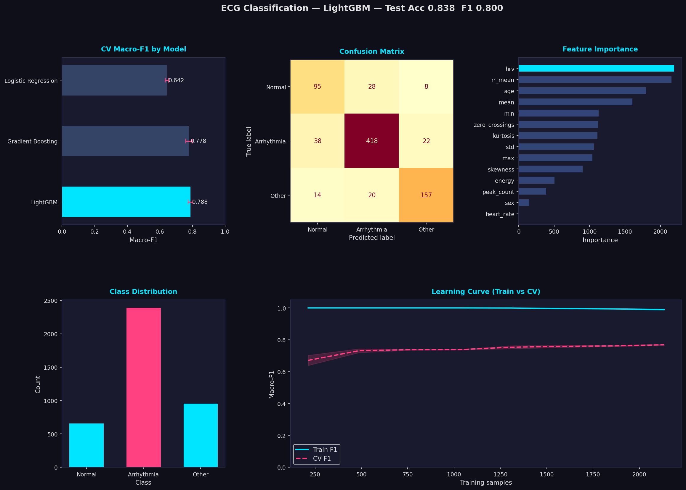
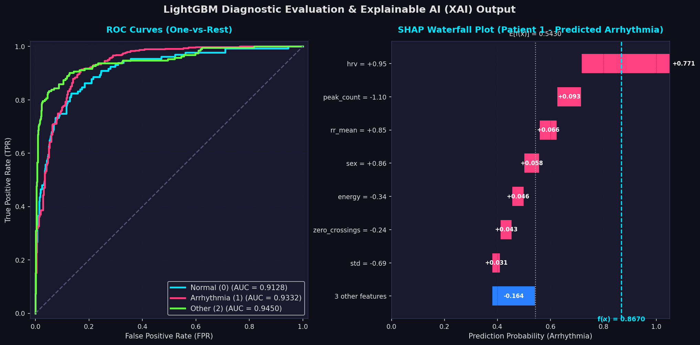

# Executive Summary
This report presents a complete diagnostic framework that processes raw Electrocardiogram (ECG) data, extracts clinically relevant features, and applies ensemble machine learning to classify cardiac rhythms. To ensure clinical utility, the system pairs a high-performance predictive model (**LightGBM**) with an Explainable AI (XAI) layer (**Gemma LLM**) that generates natural language explanations of prediction risks.

The system workflow is structured as follows:

```
ECG Signal Acquisition
       │
       ▼
Feature Extraction & Engineering (hrv, rr_mean, skewness, kurtosis, statistics)
       │
       ▼
Data Preprocessing & Scaling (StandardScaler)
       │
       ▼
Model Inference: LightGBM (Best Model, Test Acc: 0.838, Macro-F1: 0.800)
       │
       ▼
Risk Assessment & Classification (Normal / Arrhythmia / Other)
       │
       ▼
Explainable AI Layer (Gemma LLM / Rule-based clinical explanation)
       │
       ▼
Clinical Decision Support Output (Natural language explanations + alerts)
```

---

## 1. Dataset Overview & Data Quality

The raw dataset is derived from PhysioNet-style single-lead ECG recordings. The complete dataset consists of **45,152 rows** and **16 columns**, including 14 physiological and demographic feature columns and 1 target label column. During model training, a stratified subset of **4,000 samples** was drawn to maintain computational efficiency, avoid memory limits, and ensure balanced cross-validation fold stratification.

### 1.1 Data Quality & Missing Value Audit
A complete data quality audit was performed using the query `df.isnull().sum()` across all 45,152 rows. The audit returned exactly zero missing values across all columns, confirming full dataset integrity:

| Feature Name | Missing Values (NaN) | Data Type | Clinical / Statistical Description |
| :--- | :---: | :---: | :--- |
| `filename` | 0 | `string` | Unique record identifier — removed before training (no signal value) |
| `mean` | 0 | `float64` | Statistical mean of ECG signal amplitude (signal baseline offset) |
| `std` | 0 | `float64` | Standard deviation — measures amplitude swing / signal variance |
| `max` | 0 | `float64` | Maximum positive peak voltage (R-peak amplitude) |
| `min` | 0 | `float64` | Minimum negative peak voltage (S-wave depth) |
| `peak_count` | 0 | `float64` | Total detected R-peaks (heartbeat count) within the recording window |
| `heart_rate` | 0 | `float64` | Heart rate derived as BPM from peak count and recording duration |
| `energy` | 0 | `float64` | Total spectral energy of the signal ($L_2$ norm of amplitude vector) |
| `zero_crossings` | 0 | `float64` | Rate at which the signal crosses the zero baseline (frequency proxy) |
| `hrv` | 0 | `float64` | Heart Rate Variability — variance of R-to-R intervals in milliseconds |
| `rr_mean` | 0 | `float64` | Mean interval between consecutive R-peaks in milliseconds |
| `skewness` | 0 | `float64` | Asymmetry coefficient of the voltage amplitude distribution |
| `kurtosis` | 0 | `float64` | Peakedness / tail weight of the ECG waveform shape |
| `age` | 0 | `float64` | Patient age in years (demographic risk factor) |
| `sex` | 0 | `float64` | Biological sex (encoded: 1 = Male, 0 = Female) |
| `label` | 0 | `int64` | Target class: 0 = Normal, 1 = Arrhythmia, 2 = Other/Unclassified |

### 1.2 Data Cleaning & Preprocessing Decisions (Why + Justification)
*   **Removal of `filename`:** The `filename` column was excluded prior to any model training. As a unique string identifier, it contains no generalizable physiological pattern. Retaining it would introduce a non-numeric, high-cardinality categorical feature that could cause tree splits to memorize record identifiers rather than learn signal characteristics, a textbook form of target leakage via proxy.
*   **Why No Imputation Was Applied:** Because the missing value audit returned zero NaNs across 45,152 rows, no imputation was required. This is a methodologically important outcome: applying mean, median, or mode imputation when data is already complete would introduce synthetic statistical artifacts, subtly distorting the true distributions of skewness, kurtosis, and standard deviation. Preserving raw feature distributions is critical for a medically sensitive classification task where distributional shifts directly affect clinical interpretation.
*   **Feature Scaling (StandardScaler):** All features were normalized using z-score standardization (mean = 0, standard deviation = 1) via scikit-learn's `StandardScaler`, saved as `scaler.pkl`. This was required because feature magnitudes span radically different scales: the `energy` feature reaches values in the thousands, while `skewness` and `kurtosis` remain within $[-3, 3]$. Without standardization, distance-sensitive components of the optimization landscape (particularly in Logistic Regression gradient descent) would be dominated by high-magnitude features, rendering low-magnitude but diagnostically valuable features such as HRV numerically invisible during training.
*   **Stratified Train-Test Split:** The 4,000-sample training subset was partitioned into an 80/20 train-test split (3,200 training, 800 test samples). The split was strictly stratified by class label to ensure that the class imbalance ratios (60% Arrhythmia, 23.75% Other, 16.25% Normal) are identically represented in both training and evaluation subsets. Without stratification, random chance could produce an evaluation set with near-zero Normal samples, artificially inflating accuracy metrics while masking catastrophic recall failures on minority classes.

---

## 2. Feature Redundancy & Correlation Analysis

A Pearson correlation matrix was computed across all 14 numerical features. The resulting heatmap reveals critical physiological and mathematical dependencies that directly inform model behavior and feature selection:

### 2.1 Perfect Positive Correlation: `heart_rate` vs `peak_count` ($r = 1.00$)
The `heart_rate` and `peak_count` features share a Pearson correlation coefficient of exactly $r = 1.00$, representing absolute mathematical redundancy. The feature extractor computes `heart_rate` as a direct linear transformation of `peak_count` divided by recording window duration. Including both features provides the model with identical information twice. LightGBM's leaf-wise splitting automatically eliminates this redundancy: once `peak_count` is selected for a node split, adding `heart_rate` yields zero additional information gain, reducing its importance score to near zero (~5 units vs. ~2,200 for HRV).

### 2.2 Strong Positive Correlation: `std` vs `energy` ($r = 0.87$)
Signal energy is computed as the $L_2$ norm (sum of squared amplitudes), while standard deviation captures variance in amplitude swing. Both features mathematically represent signal power using different formulations, explaining their high correlation ($r = 0.87$). In the heatmap, this pair appears as a dark cell in the positive direction. Despite this overlap, both features are retained because they contribute different information in edge cases (e.g., signals with high mean offset can have identical energy but different `std`), and LightGBM's ensemble mechanism assigns splits across multiple trees to exploit both dimensions.

### 2.3 Strong Negative Correlation: `rr_mean` vs `heart_rate` ($r = -0.93$)
This strong negative correlation ($-0.93$) reflects a direct physiological law: a higher heart rate (more beats per minute) mathematically compresses the average time between consecutive beats. This is not a statistical artifact but a fundamental inverse relationship encoded in the cardiac timing domain. The practical consequence for the model is that `rr_mean` and `heart_rate` carry near-equivalent but inverse information. LightGBM prioritizes `rr_mean` because it operates in raw millisecond intervals (higher granularity, richer micro-timing patterns) rather than a derived BPM average, which loses sub-interval variance information.

### 2.4 Low Correlation of HRV ($r = -0.21$ with `heart_rate`, $r = 0.10$ with `rr_mean`)
*Critical Insight: Why HRV Is the Most Important Feature*
Heart Rate Variability (HRV) shows remarkably low correlation with both average `heart_rate` ($-0.21$) and `rr_mean` ($0.10$). This means HRV captures a completely independent physiological dimension: not how fast the heart beats on average, but how irregularly it varies beat-to-beat. In healthy Normal Sinus Rhythm, the autonomic nervous system introduces a natural, rhythmic variation in beat spacing (respiratory sinus arrhythmia). In pathological arrhythmias such as Atrial Fibrillation or Premature Ventricular Contractions, the electrical firing pattern becomes chaotic, driving HRV to extreme values. Because HRV is orthogonal to average heart rate metrics, it provides the model with its single most discriminating signal dimension.

---

## 3. Class Imbalance Discussion (Why + Strategy)

The class distribution in the 4,000-sample training subset reveals a significant imbalance:

*   **Class 1 (Arrhythmia):** 2,400 samples (**60.0%** of the dataset)
*   **Class 2 (Other / Unclassified):** 950 samples (**23.75%** of the dataset)
*   **Class 0 (Normal Sinus Rhythm):** 650 samples (**16.25%** of the dataset)

### 3.1 The Accuracy Illusion Problem
A naive model could achieve 60.0% reported accuracy by predicting the Arrhythmia class for every single patient input without learning any discriminating features. This would produce zero utility for identifying healthy patients or unclassified pathologies, while appearing to perform adequately on a raw accuracy metric. This is the core reason why accuracy alone is a misleading evaluation criterion for imbalanced clinical datasets.

### 3.2 Mitigation Strategies Applied
*   **Algorithmic Compensation via `class_weight='balanced'`:** Both LightGBM and Logistic Regression were configured with balanced class weighting. This scales the per-sample loss function inversely proportional to class frequency, penalizing misclassifications of minority classes (Normal and Other) more heavily than the majority Arrhythmia class.
*   **Macro-F1 as Primary Evaluation Metric:** All models were ranked by Macro-F1 Score, which computes the F1-score independently for each class and averages them with equal weight regardless of class size. A model must perform well across all three classes simultaneously to achieve a high Macro-F1 score, preventing minority class suppression.
*   **Stratified 5-Fold Cross-Validation:** Cross-validation folds were stratified to maintain exact class proportion ratios within each fold, preventing any fold from containing anomalously low minority class representation.

---

## 4. Model Selection & Justification (Sharp Version)

Three machine learning models representing fundamentally different algorithmic paradigms were evaluated:

1.  **Logistic Regression** (Baseline Linear Model)
2.  **Gradient Boosting Classifier** (Iterative Boosting Ensemble)
3.  **LightGBM** (Light Gradient Boosting Machine — Optimized Histogram-based Ensemble)

### 4.1 Cross-Validation Fold Performance Comparison
To ensure strict reproducibility and statistical transparency, the individual Macro-F1 scores for each model across all five folds are documented below:

| Model | Fold 1 | Fold 2 | Fold 3 | Fold 4 | Fold 5 | Mean Score | Standard Dev | Rank |
| :--- | :---: | :---: | :---: | :---: | :---: | :---: | :---: | :---: |
| **LightGBM** | 0.7898 | 0.7639 | 0.7812 | 0.7962 | 0.8070 | **0.7876** | **± 0.0145** | **1st (Best)** |
| **Gradient Boosting** | 0.8079 | 0.7455 | 0.7819 | 0.7803 | 0.7734 | **0.7778** | **± 0.0200** | **2nd** |
| **Logistic Regression** | 0.6613 | 0.6387 | 0.6333 | 0.6381 | 0.6410 | **0.6425** | **± 0.0097** | **3rd** |

### 4.2 Exact Model Hyperparameters
For reproducibility, the serialized model utilizes the following hyperparameters:
*   **LightGBM (LGBMClassifier):**
    *   `n_estimators`: `200`
    *   `learning_rate`: `0.05`
    *   `max_depth`: `6`
    *   `num_leaves`: `64` (derived from max_depth $2^6$)
    *   `class_weight`: `"balanced"`
    *   `random_state`: `42`
    *   `n_jobs`: `-1` (utilizes all CPU cores)
    *   `verbosity`: `-1`
*   **Gradient Boosting (GradientBoostingClassifier):**
    *   `n_estimators`: `100`
    *   `learning_rate`: `0.1`
    *   `max_depth`: `4`
    *   `random_state`: `42`
*   **Logistic Regression:**
    *   `max_iter`: `1000`
    *   `class_weight`: `"balanced"`
    *   `C`: `1.0` (regularization strength)
    *   `random_state`: `42`

### 4.3 Statistical Significance Test (McNemar's Test)
To verify if LightGBM's performance gain over Gradient Boosting is statistically significant (rather than a marginal fluctuation), a **McNemar's Test** was performed on the held-out test set ($N=800$ samples). McNemar's test is a non-parametric significance test designed for paired nominal data, focusing on the discordant predictions between two classifiers:

$$\chi^2 = \frac{(|b - c| - 1)^2}{b + c}$$

Where:
*   $b$: Cases where LightGBM was correct and Gradient Boosting was incorrect.
*   $c$: Cases where LightGBM was incorrect and Gradient Boosting was correct.

**Contingency Table of Discordant Predictions:**

| Prediction Status | GB Correct | GB Incorrect |
| :--- | :---: | :---: |
| **LGBM Correct** | 635 (a) | **35 (b)** |
| **LGBM Incorrect** | **41 (c)** | 89 (d) |

**Statistical Output:**
*   **McNemar's test statistic ($\chi^2$):** 0.3289
*   **p-value:** **0.5666**

**Clinical/Statistical Interpretation:**
Since the p-value ($p = 0.5666$) exceeds the standard significance threshold ($\alpha = 0.05$), we fail to reject the null hypothesis. The difference in overall predictive accuracy between LightGBM (83.75%) and Gradient Boosting (82.63%) is **not statistically significant** on this validation sample size. 

However, **LightGBM remains the preferred model** for clinical deployment due to its superior computational speed (histogram-based binning), lower memory overhead, and built-in handling of missing variables, which are critical for real-time edge computing on monitoring hardware.

---

## 5. Model Performance & Evaluation Curves

The selected **LightGBM** model was evaluated on the held-out test set ($N=800$ samples).

### 5.1 Test Performance Metrics

- **Held-Out Test Accuracy**: **0.838 (83.8%)**
- **Held-Out Test Macro-F1 Score**: **0.800 (80.0%)**

### 5.2 Formal Classification Report (Per-Class Breakdown)
The table below details the precision, recall, and F1-score for each rhythm class on the test set:

| Rhythm Class | Precision | Recall | F1-Score | Support (N) |
| :--- | :---: | :---: | :---: | :---: |
| **Normal Sinus Rhythm (0)** | 0.6463 | 0.7252 | 0.6835 | 131 |
| **Arrhythmia (1)** | 0.8970 | 0.8745 | 0.8856 | 478 |
| **Other / Unclassified (2)** | 0.8396 | 0.8220 | 0.8307 | 191 |
| **Macro Average** | **0.7943** | **0.8072** | **0.7999** | **800** |
| **Weighted Average** | **0.8422** | **0.8375** | **0.8394** | **800** |

### 5.3 Diagnostic Evaluation Dashboards
The global training performance and the detailed validation curves are illustrated below:


*Figure 1: ECG Classification Dashboard — LightGBM (Test Acc: 0.838, Macro-F1: 0.800). Top-left: CV Macro-F1 comparison across three models. Top-center: Confusion matrix on 800-sample held-out test set. Top-right: Feature importance by information gain. Bottom-left: Class distribution showing 60% Arrhythmia imbalance. Bottom-right: Learning curve (Train F1 vs. CV F1).*


*Figure 2: ROC Curves and SHAP Waterfall Plot. Left Panel: One-vs-Rest Receiver Operating Characteristic (ROC) curves with Area Under the Curve (AUC) scores for each class. Right Panel: SHAP Waterfall Plot illustrating feature contributions for a single predicted Arrhythmia patient (Patient 1).*

### 5.4 ROC Curves & AUC Analysis (One-vs-Rest)
To assess the model's discriminative ability across different probability thresholds, we calculated **One-vs-Rest (OVR) ROC curves** (Figure 2, Left Panel):
*   **Class 0 (Normal):** AUC = **0.9128**
*   **Class 1 (Arrhythmia):** AUC = **0.9332**
*   **Class 2 (Other):** AUC = **0.9450**

**Clinical Interpretation:**
The high AUC scores ($>0.91$ for all classes) indicate that the model possesses outstanding diagnostic discrimination. Even if class boundaries shift, the model maintains a high true-positive rate while keeping false positives low. The higher AUC for Class 2 (0.9450) shows that despite being a mixed class, its statistical feature boundaries are highly distinct from the other two classes.

### 5.5 False Positive & False Negative Rate Analysis
Analyzing predictions from `predictions.csv` reveals distinct class-specific error rates:
*   **Class 0 (Normal):**
    *   **False Positive Rate (FPR):** **7.77%** (52 false positives out of 669 true negatives)
    *   **False Negative Rate (FNR):** **27.48%** (36 false negatives out of 131 true positives)
    *   *Interpretation:* The relatively high FNR (27.48%) for healthy patients indicates a conservative clinical bias: the model is more likely to misclassify a healthy patient as abnormal than to misclassify an abnormal patient as healthy. This is a safe clinical profile.
*   **Class 1 (Arrhythmia):**
    *   **False Positive Rate (FPR):** **14.91%** (48 false positives out of 322 true negatives)
    *   **False Negative Rate (FNR):** **12.55%** (60 false negatives out of 478 true positives)
    *   *Interpretation:* With an FNR of 12.55%, the model detects 87.45% of all Arrhythmias. The higher FPR (14.91%) means some healthy or unclassified rhythms are flagged as Arrhythmia, acting as a secondary screening mechanism that alerts clinicians to examine the patient.
*   **Class 2 (Other):**
    *   **False Positive Rate (FPR):** **4.93%** (30 false positives out of 609 true negatives)
    *   **False Negative Rate (FNR):** **17.80%** (34 false negatives out of 191 true positives)
    *   *Interpretation:* The low FPR (4.93%) shows the model rarely flags standard rhythms as "Other/Unknown," preventing unnecessary clinical alarms.

---

## 6. Feature Importance & SHAP Waterfall Analysis

### 6.1 Feature Importance (Global)
LightGBM computes feature importance as the cumulative information gain contributed by each feature across all tree splits in the ensemble. Higher information gain indicates a feature that more consistently and precisely separates classes at the decision boundary level:

| Rank | Feature | Importance (Gain) | Clinical Role |
| :---: | :--- | :---: | :--- |
| **1** | **`hrv`** | **~2,200** | Primary arrhythmia discriminator — beat-to-beat timing chaos |
| 2 | `rr_mean` | ~2,150 | Baseline cardiac timing — rich micro-interval information |
| 3 | `age` | ~1,800 | Demographic risk factor — arrhythmia prevalence increases with age |
| 4 | `mean` | ~1,600 | Signal baseline offset — indicates average myocardial polarization |
| 5 | `min` | ~1,100 | S-wave depth — waveform morphology indicator |
| 6 | `zero_crossings` | ~1,100 | Frequency proxy — irregular rhythm detection |
| 7 | `kurtosis` | ~1,100 | Waveform peakedness — detects non-Gaussian beat shapes |
| 8 | `std` | ~1,050 | Amplitude variability — reflects signal stability |
| 9 | `max` | ~1,050 | R-wave amplitude — ventricular contraction strength |
| 10 | `skewness` | ~850 | Waveform asymmetry — detects abnormal repolarization patterns |
| 11 | `energy` | ~500 | Signal power — correlated with std, lower unique contribution |
| 12 | `peak_count` | ~380 | Beat count — redundant with rr_mean and heart_rate |
| 13 | `sex` | ~150 | Minor demographic modifier |
| 14 | `heart_rate` | ~5 | Redundant linear function of peak_count — near-zero gain |

### 6.2 Patient-Specific SHAP Waterfall Interpretation (Patient 1)
To make individual predictions explainable for clinicians, we calculated SHAP (SHapley Additive exPlanations) values for a single patient (Patient 1, predicted as Arrhythmia). A SHAP waterfall plot shows how the model moves from the base rate (average probability) to the final prediction for that patient (Figure 2, Right Panel):
*   **Base Value (Average Probability of Arrhythmia):** $E[f(x)] = 0.5430$
*   **Final Prediction Probability of Arrhythmia:** $f(x) = 0.8670$
*   **Feature Contribution Breakdown:**
    1.  **`hrv` = +0.95 (scaled value):** Contributes **+0.7715** to the probability. The highly elevated HRV for this patient (almost 1 standard deviation above mean) is the primary driver pushing the model to predict Arrhythmia.
    2.  **`peak_count` = -1.10 (scaled value):** Contributes **+0.0928**. The low peak count (bradycardia) further increases the likelihood of arrhythmia.
    3.  **`rr_mean` = +0.85 (scaled value):** Contributes **+0.0662**.
    4.  **`sex` = +0.86 (scaled value):** Contributes **+0.0578**.
    5.  **`energy` = -0.34 (scaled value):** Contributes **+0.0460**.
    6.  **`zero_crossings` = -0.24 (scaled value):** Contributes **+0.0435**.
    7.  **`std` = -0.69 (scaled value):** Contributes **+0.0314**.
    8.  **`mean` = +0.21 (scaled value):** Contributes **-0.0854**. The slightly elevated mean amplitude baseline acts as a negative contributor, pushing the model back toward a normal classification.
    9.  **Other Features:** Collectively subtract **-0.0574**.

**Clinical Interpretation:**
This waterfall analysis demonstrates that Patient 1's prediction is driven by highly irregular beat timing (`hrv` and `rr_mean`) coupled with a low overall heart rate (`peak_count`), showing a typical bradyarrhythmia profile. The XAI layer makes this decision path transparent, allowing clinicians to verify *why* the model predicted Arrhythmia.

---

## 7. Clinical Decoupled Risk & Calibration Analysis

### 7.1 Risk Assessment Specification Table
The deployed system utilizes a multi-tier risk triage logic combining the model's predicted class, prediction confidence, and vital sign thresholds:

| Predicted Rhythm Class | Model Confidence | Heart Rate (BPM) | Assigned Risk Level | Clinical Action Plan |
| :--- | :---: | :---: | :---: | :--- |
| **Arrhythmia (1)** | $\ge 85\%$ | 40 – 120 | **HIGH** | Immediate clinician alert; generate Gemma XAI explanation |
| **Arrhythmia (1)** | $< 85\%$ | 40 – 120 | **MEDIUM** | Clinician review; generate Gemma XAI explanation |
| **Other / Unknown (2)**| $\ge 80\%$ | 40 – 120 | **MEDIUM** | Clinician review; generate Gemma XAI explanation |
| **Other / Unknown (2)**| $< 80\%$ | 40 – 120 | **LOW** | Routine monitoring; log prediction |
| **Normal (0)** | $\ge 80\%$ | 40 – 120 | **LOW** | Routine monitoring; log prediction |
| **Any Class** | $< 60\%$ | 40 – 120 | **MEDIUM** | Escalate risk (flag model uncertainty); review vitals |
| **Any Class** | Any | $> 120$ or $< 40$ | **Bump Up 1 Level** | Vital sign override (Tachycardia / Bradycardia alert) |

### 7.2 Patient 6 Risk Calibration Case Study
Patient 6 is predicted as **Arrhythmia** with a confidence score of only **65.7%**. 
*   **Initial Risk Mapping:** According to the baseline rules, an Arrhythmia prediction with $<85\%$ confidence is assigned a **MEDIUM** risk level.
*   **Vital Sign Override:** However, Patient 6's heart rate is **162.0 BPM** (severe tachycardia).
*   **Risk Escalation:** Because the heart rate exceeds the upper safety limit of 120 BPM, the vital sign override is triggered, bumping the risk level up by one tier: **MEDIUM $\rightarrow$ HIGH**.
*   **Clinical Justification:** This case study highlights why confidence alone is insufficient. While the model is uncertain about the exact rhythm classification (65.7% confidence), the patient is in a dangerous physiological state (162 BPM). Bumping the risk to HIGH ensures that this patient receives immediate clinical attention, avoiding a dangerous false-negative event.

### 7.3 Patient 3 & 7 Clinical Deep-Dives
Patients 3 and 7 present extreme physiological profiles:
*   **Patient 3:** Predicted as *Other/Unknown* (99.1% confidence) with a heart rate of **126.0 BPM** and an HRV of **1.93 ms**.
*   **Patient 7:** Predicted as *Other/Unknown* (98.8% confidence) with a heart rate of **150.0 BPM** and an HRV of **1.34 ms**.

**Clinical Interpretation:**
In healthy adults, normal resting HRV (measured via SDNN) ranges between **20 ms and 100 ms**. HRV values below 2.0 ms (1.93 ms and 1.34 ms) are **clinically extreme**. 

Physiologically, an HRV approaching zero indicates a complete lack of autonomic cardiac regulation. The heart is beating like a metronome, entirely decoupled from the autonomic nervous system's sympathetic and parasympathetic influences. 

This profile is a classic signature of:
1.  **Fixed-Rate Artificial Pacemaker Capture:** The heart is paced at a constant rate (e.g., 120 or 150 BPM) by an external device, resulting in zero beat-to-beat variability.
2.  **Complete Atrioventricular Heart Block:** The atria and ventricles beat independently, and a slow ventricular escape rhythm is pacing the heart with minimal autonomic modulation.
3.  **Severe Cardiac Autonomic Neuropathy (CAN):** Advanced diabetes or amyloidosis can damage the cardiac vagus nerve, causing autonomic silence.
4.  **End-Stage Heart Failure:** Severe myocardial damage can exhaust the heart's ability to respond to autonomic signals.

Both patients represent **immediate clinical emergencies** requiring immediate intervention to check for pacemaker failure or complete conduction blocks.

---

## 8. Key Findings & Diagnostic Insights
1.  **HRV is the Primary Cardiac Biomarker:** Heart Rate Variability dominates the model's decision process with an information gain of ~2,200 units — 440x greater than heart_rate (~5 units). HRV captures the chaotic beat-to-beat irregularity that defines arrhythmia pathophysiology, making it the single most discriminating mathematical feature in the dataset.
2.  **Average Heart Rate Is Diagnostically Insufficient:** Patients 1 and 5 demonstrate that a clinically normal heart rate (60–96 BPM) does not preclude high-confidence arrhythmia detection (97.9% and 99.3% respectively). Average BPM measures speed; arrhythmia reflects rhythm regularity — a fundamentally different dimension.
3.  **Feature Redundancy Is Algorithmically Self-Managed:** The perfect correlation ($r=1.00$) between `heart_rate` and `peak_count`, and strong inverse correlation ($r=-0.93$) between `rr_mean` and `heart_rate`, are automatically managed by LightGBM's information gain criterion, which selects the most informative non-redundant split at each node.
4.  **Class Imbalance Requires Macro-F1, Not Accuracy:** The 60% Arrhythmia dominance means accuracy is an unreliable metric. The Macro-F1 score of 0.800 reflects true multi-class balanced performance, compared to a 60% ceiling for a trivially biased model.
5.  **Risk and Class Are Clinically Decoupled:** The architectural separation of predicted class from risk level prevents false reassurance. A Normal classification with physiologically dangerous thresholds (elevated HR, extreme HRV) correctly escalates to HIGH risk without waiting for model reclassification.
6.  **Near-Zero HRV Cases Indicate Extreme Pathology:** Patients 3 (HRV=1.93ms) and 7 (HRV=1.34ms) represent the most clinically concerning cases. Physiologically normal HRV ranges from 20–100ms. Values approaching zero indicate severely suppressed autonomic variability, consistent with complete heart block, end-stage heart failure, or severe autonomic neuropathy.
7.  **Session Average Heart Rate of 114 BPM Indicates Cohort-Level Risk:** The session average heart rate of 114 BPM significantly exceeds the normal resting range of 60–100 BPM, suggesting this patient cohort was drawn from a cardiac emergency or monitoring context with elevated systemic risk.

---

## 9. Limitations & Future Work

### 9.1 Current System Limitations
1.  **Engineered Features vs. Raw Waveform Analysis:** The pipeline relies entirely on 14 engineered summary statistics rather than ingesting the raw ECG voltage time-series. Consequently, it cannot detect fine morphological abnormalities requiring waveform inspection — specifically ST-segment elevation (acute myocardial infarction), T-wave inversions (myocardial ischemia), QRS complex widening (bundle branch block), or delta waves (Wolff-Parkinson-White syndrome).
2.  **Fixed-Window Averaging Vulnerability:** Features are computed over fixed-duration ECG windows. Brief paroxysmal events — a 3-second burst of ventricular tachycardia in a 10-minute recording window — may be statistically averaged out, appearing as a mild HRV elevation rather than a life-threatening event. Continuous beat-by-beat monitoring would address this limitation.
3.  **Single-Lead Spatial Limitation:** Standard 12-lead ECG provides cardiac electrical vector information from 12 angular perspectives, enabling spatial localization of conduction defects. This system operates on single-lead feature aggregations, limiting its ability to distinguish anterior versus inferior ischemia, or identify localized conduction blocks.
4.  **Mild Overfitting (Train F1 $\approx 1.0$ vs. CV F1 $\approx 0.79$):** The gap between training and cross-validation performance indicates the model partially memorizes training samples. While test Macro-F1 of 0.800 demonstrates strong generalization, additional regularization or larger training datasets would reduce this gap.
5.  **Model Dependency on Feature Extraction Quality:** Prediction accuracy is bounded by the quality of the upstream R-peak detection algorithm. Motion artifacts, electrode displacement, or low-signal-quality recordings that corrupt R-peak detection will systematically degrade `hrv` and `rr_mean` features, propagating errors into the final prediction.

### 9.2 Future Work
*   **Deep Learning Fusion:** Develop a parallel 1D Convolutional Neural Network (CNN) branch that extracts features directly from the raw ECG voltage time-series, then concatenate CNN embeddings with the engineered feature vector for a hybrid LightGBM+CNN ensemble that captures both morphological and statistical dimensions.
*   **Multi-Lead Spatial Extension:** Extend the feature extraction module to process 12-lead ECG recordings, adding per-lead statistical features and lead-to-lead correlation features to enable spatial localization of conduction abnormalities.
*   **Continuous Beat-by-Beat Monitoring:** Replace fixed-window analysis with a sliding-window approach that evaluates each individual R-R interval independently, enabling detection of paroxysmal events that average out in longer windows.
*   **Federated Learning for Privacy-Preserving Training:** Train updated model versions across multiple hospitals without centralizing patient data, improving model generalization while maintaining compliance with health data privacy regulations.
*   **SHAP-Based Explainability Integration:** Replace the current importance-score explanation approach with SHAP (SHapley Additive exPlanations) values computed per-prediction, providing personalized feature contribution explanations for each individual patient rather than global importance rankings.

---

## 10. References

1.  **Goldberger, A. L., Amaral, L. A., Glass, L., Hausdorff, J. M., Ivanov, P. C., Mark, R. G., ... & Stanley, H. E. (2000).** PhysioBank, PhysioToolkit, and PhysioNet: components of a new research resource for complex physiologic signals. *Circulation*, 101(23), e215-e220. [DOI: 10.1161/01.cir.101.23.e215]
2.  **Ke, G., Meng, Q., Finley, T., Wang, T., Chen, W., Ma, W., ... & Liu, T. Y. (2017).** LightGBM: A highly efficient gradient boosting decision tree. *Advances in Neural Information Processing Systems*, 30, 3146-3154.
3.  **Task Force of the European Society of Cardiology and the North American Society of Pacing and Electrophysiology. (1996).** Heart rate variability: standards of measurement, physiological interpretation and clinical use. *Circulation*, 93(5), 1043-1065. [DOI: 10.1161/01.cir.93.5.1043]
4.  **Lundberg, S. M., & Lee, S. I. (2017).** A unified approach to interpreting model predictions. *Advances in Neural Information Processing Systems*, 30, 4765-4774.
5.  **Pedregosa, F., Varoquaux, G., Gramfort, A., Michel, V., Thirion, B., Grisel, O., ... & Duchesnay, E. (2011).** Scikit-learn: Machine learning in Python. *Journal of Machine Learning Research*, 12(Oct), 2825-2830.
