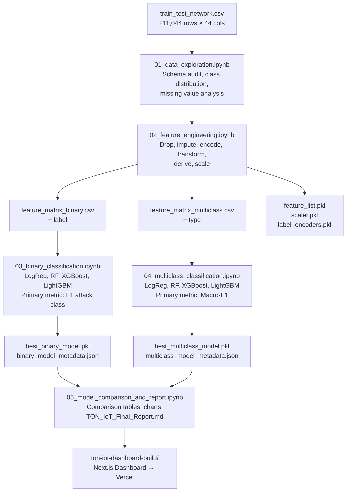

# TON_IoT Network Intrusion Detection — Flow Diagrams

> **Project**: TON_IoT Network Intrusion Detection Pipeline  
> **Author**: Kshitiz Khandelwal

---

## 1. End-to-End System Flow Diagram (ASCII)

```
Raw Network Traffic CSV
train_test_network.csv
(211,044 rows × 44 columns)
         |
         v
┌─────────────────────────────────────────┐
│           Phase 1: Data Exploration     │
│  • Load CSV, confirm shape              │
│  • Audit missing values (-  placeholders)│
│  • Plot class distributions             │
│  • Document schema and cardinality      │
└─────────────────────────────────────────┘
         |
         v
┌─────────────────────────────────────────┐
│       Phase 2: Feature Engineering     │
│  • Drop: src_ip, dst_ip, high-card strs │
│  • Impute: median (num), 'unknown' (cat) │
│  • LabelEncode: proto, service, conn_   │
│    state, weird_name                    │
│  • Binary-encode: dns_AA, ssl_resumed...│
│  • log1p transform: bytes, pkts, dur    │
│  • Derive: byte_ratio, avg_pkt_size,    │
│    is_well_known_port                   │
│  • StandardScaler (fit on train only)   │
│  • Save: feature_matrix_binary.csv      │
│          feature_matrix_multiclass.csv  │
│          feature_list.pkl               │
│          scaler.pkl, label_encoders.pkl │
└─────────────────────────────────────────┘
         |
         v
         +----------------------------------+
         |                                  |
         v                                  v
┌─────────────────────┐          ┌─────────────────────┐
│  Phase 3: Binary    │          │  Phase 4: Multi-    │
│  Classification     │          │  Class Classification│
│                     │          │                     │
│  label: 0 or 1      │          │  type: backdoor,    │
│  (benign vs attack) │          │  ddos, dos, etc.    │
│                     │          │                     │
│  Models:            │          │  Models:            │
│  • Logistic Reg.    │          │  • Logistic Reg.    │
│  • Random Forest    │          │  • Random Forest    │
│  • XGBoost          │          │  • XGBoost          │
│  • LightGBM         │          │  • LightGBM         │
│                     │          │                     │
│  Metric: F1         │          │  Metric: Macro-F1   │
│  (attack class)     │          │  (all attack types) │
│                     │          │  Winner: RF         │
│  Winner: RF         │          │                     │
└─────────────────────┘          └─────────────────────┘
         |                                  |
         +----------------------------------+
                       |
                       v
         ┌─────────────────────────────────┐
         │  Phase 5: Model Comparison &    │
         │  Report Generation              │
         │  • Comparison table (4 models   │
         │    × binary + multi-class)      │
         │  • Confusion matrices           │
         │  • ROC and PR curves            │
         │  • Feature importance           │
         │  • Sample predictions           │
         │  • TON_IoT_Final_Report.md      │
         └─────────────────────────────────┘
                       |
                       v
         ┌─────────────────────────────────┐
         │  Phase 6: Next.js Dashboard     │
         │  ton-iot-dashboard-build/       │
         │  • Next.js + Tailwind + Recharts│
         │  • Deployed to Vercel           │
         └─────────────────────────────────┘
```

---

## 2. Mermaid Architecture Diagram


